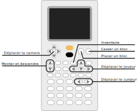

# Numcraft

Tout le monde adore Minecraft. Qui n'a jamais voulu y jouer sur sa
calculatrice ? Avec Numcraft, vos rêves deviennent réalité. Découvrez un jeu en
3D tournant entre 20 et 40 FPS en jeu (la vitesse dépend de votre modèle de
calculatrice) directement sur votre calculatrice. Construisez ce que vous voulez
dans ce monde, limité par la taille du monde et votre créativité.

Jeu conçu par [Yannis300307](https://github.com/yannis300307/).

## Téléchargement

Les versions officielles sont disponibles sur [GitHub Releases](https://github.com/yannis300307/NumcraftRust/releases).

Si vous préférez, vous pouvez télécharger Numcraft depuis ce lien (qui pourrait
ne pas être à jour car le jeu est en développement rapide) :

- [Numcraft v0.1.3](https://github.com/yannis300307/NumcraftRust/releases/download/v0.1.3/Numcraft.nwa), meilleure génération du monde, crafting
- [Numcraft v0.1.0](https://github.com/yannis300307/NumcraftRust/releases/download/v0.1.0/Numcraft.nwa), mode survie, collisions, objets
- [Numcraft v0.0.9](https://github.com/yannis300307/NumcraftRust/releases/download/v0.0.9/Numcraft.nwa), mode créatif, inventaire
- [Numcraft v0.0.8](https://github.com/yannis300307/NumcraftRust/releases/download/v0.0.8/Numcraft.nwa)

<!-- - [Numcraft v0.1.3](https://yaya-cout.github.io/Nwagyu/assets/apps/numcraft-0.1.3.nwa), meilleure génération du monde, crafting
- [Numcraft v0.1.0](https://yaya-cout.github.io/Nwagyu/assets/apps/numcraft-0.1.0.nwa), mode survie, collisions, objets
- [Numcraft v0.0.9](https://yaya-cout.github.io/Nwagyu/assets/apps/numcraft-0.0.9.nwa), mode créatif, inventaire
- [Numcraft v0.0.8](https://yaya-cout.github.io/Nwagyu/assets/apps/numcraft-0.0.8.nwa) -->

::: warning
Les fichiers de sauvegarde ne sont pas compatibles entre toutes les versions.
:::

## Comment jouer

Les contrôles peuvent sembler complexe à première vue, mais une fois que vous
les comprenez, ils deviennent plutôt simples à retenir :

| Action                                       | NumWorks            |
| -------------------------------------------- | ------------------- |
| Caméra                                       | Flèches             |
| Avancer                                      | Boite à outils      |
| Reculer                                      | Virgule             |
| Gauche                                       | Imaginaire (i)      |
| Droite                                       | Puissance (e^x)     |
| Monter                                       | Shift               |
| Descendre                                    | Exponentielle (e^x) |
| Déplacer le sélecteur de bloc vers la gauche | Parenthèse gauche   |
| Déplacer le sélecteur de bloc vers la droite | Parenthèse droite   |
| Ouvrir l'inventaire                          | Var                 |
| Poser un block                               | OK                  |
| Casser un block                              | Retour              |
| Sauvegarder et quitter                       | EXE                 |

Les touches de déplacement (avancer, reculer, gauche et droite) forment une
croix directionnelle comme les flèches sur un ordinateur (ou les touches ZQSD si
vous préférez).

## Installation

Pour installer l'application Numcraft, suivez les instructions dans le guide
[comment installer](../help/how-to-install.md).

## Code source

Le code source de Numcraft est disponible
[ici](https://github.com/yannis300307/NumcraftRust/).
