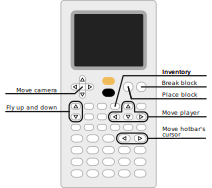

# Numcraft

Everybody loves Minecraft-like games. Did you ever want to play it on your
calculator? Thanks to Numcraft, your dreams can now be realized. Enter a 3D game
usually running between 20 FPS and 40 FPS during normal gameplay (speed depends
on your calculator model) directly on your calculator. Build anything you want
in this sandbox as long as it fit the map and your creativity.

Game created by [Yannis300307](https://github.com/yannis300307/).

## Download

Official releases are available on [GitHub Releases](https://github.com/yannis300307/NumcraftRust/releases).

If you prefer, you can download Numcraft from this link (could be outdated as
the game is in rapid development):

- [Numcraft v0.0.9](https://yaya-cout.github.io/Nwagyu/assets/apps/numcraft-0.0.9.nwa), creative mode, inventory
- [Numcraft v0.0.8](https://yaya-cout.github.io/Nwagyu/assets/apps/numcraft-0.0.8.nwa)

## How to play

The controls can look complex for the first time, but once you understand them,
they're quite easy to remember:

| Action                  | NumWorks          |
| ----------------------- | ----------------- |
| Camera                  | Arrow keys        |
| Go forward              | Toolbox           |
| Go backward             | Comma             |
| Left                    | Imaginary (i)     |
| Right                   | Power (e^x)       |
| Go upward               | Shift             |
| Go downward             | Exponential (e^x) |
| Move block cursor left  | Left parenthesis  |
| Move block cursor right | Right parenthesis |
| Open inventory          | Var               |
| Place a block           | OK                |
| Destroy a block         | Back              |
| Save and exit           | EXE               |

The motion keys (forward, backward, left and right) keys form a pattern like a
computer arrow keys (or WASD keys if you prefer).

## Installation

To install the Numcraft app, follow the instructions in the
[how to install](../help/how-to-install.md) guide.

## Source code

Source code for Numcraft is available
[here](https://github.com/yannis300307/NumcraftRust/).
