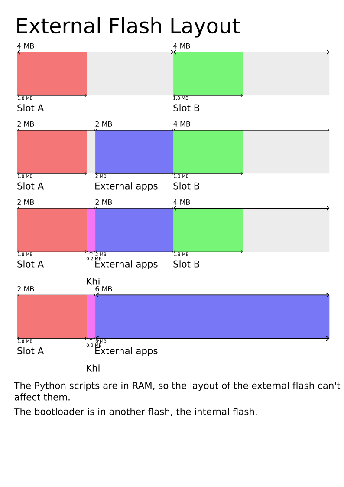

# Slots

The calculator operating system is stored in slots, with the flash being divided
in two equal parts of 4MB (total of 8MB).

## Epsilon

On the stock OS, each slot contain a [kernel], an [userland], an username and an
exam mode storage zone. In most cases, both slots contains the same OS version.
Having two copies of the OS doesn't have a big benefit in their case:
<!-- TODO: Link to headers page for userland and username -->

- It allows loading the official OS when resetting the calculator instead of
  falling back to the rescue screen.
- When enabling exam mode in an untrusted (user built) OS, the calculator will
  enable exam mode then reboot to the official slot, which has LED access

Except the specific case of rebooting to stock OS, the slot system is pretty
useless.

Slots doesn't exist hardware-wise, it's just a software separation. In fact, if
the slot A took 8MB, it would overwrite the slot B and work as-is (there would
be a linker script to edit as the linker is told to link only in a 4MB zone, but
it doesn't require big code changes).

The whole slot is signed using a single signature for both the [userland] and
the [kernel], verified by the [bootloader].

<!-- TODO: More informations about the signature -->

See [loading custom userland] for more information about loading custom userland
on a locked calculator.

### KhiCAS on Epsilon

If you installed [KhiCAS] on Epsilon, with the NWA version, you probably saw the
installation procedure require installing KhiCAS through another website, then a
small NWA app.

This is required as KhiCAS is quite big, reduced to 4MB in the small Epsilon
version. Space available to external apps is variable between Epsilon versions,
but is roughly around 2.5MB.

In the [old KhiCAS version], the storage limit was simply bypassed using
[Nwagra](../../guide/help/enlarge-your-memory.md), but Nwagra broke when Epsilon
stored it's exam mode state right after the applications zone, as applications
were now conflicting with exam mode state, leading to the calculator showing
exam mode enabled and corrupting the apps when trying to disable it.

To workaround this problem, KhiCAS binary is flashed on the slot B manually. To
launch KhiCAS, a small NWA app is installed, doing a few initialization things,
then starting the full app.

<!-- TODO: Link to addresses -->

## Custom firmwares

On custom firmwares, slots are exploited in a more useful way than on stock OS
with locked bootloader: both slots can contain different OS, allowing on-the-fly
switching, without computer, just by resetting the calculator. For example, the
most common dual-boot config is Upsilon in the slot A (first slot) and Epsilon
in the slot B (second slot).

On [Upsilon] and [Omega], external apps archive is stored at the address
`0x90200000`, 2MB after the beginning of the slot A. In case more than 2MB of
external apps are flashed, the slot B is overwritten to allow up to 6MB of
external apps, required when using KhiCAS (5.2MB).
[Upsilon bootloader](bootloader.md#custom-bootloader) require flashing apps from
the bootloader as the other slot is read-only.

| Slot name | Slot address |
| --------- | ------------ |
| A         | `0x90000000` |
| Khi       | `0x90180000` |
| B         | `0x90400000` |

### Slot Khi

With [Upsilon] and [Khi] bootloader, there is a third slot (bound to the 2 key
in Upsilon bootloader).

This slot was designed to hold a specific version of Khi (a fork of Omega), with
all native applications removed to reduce memory usage, both in terms of flash
and RAM. It's designed to be used alongside with KhiCAS. In this config, you
would have way more RAM for KhiCAS, to do more complex computations or run big
scripts. It also allowed to have KhiCAS alongside Epsilon in exam mode, but is a
bit broken on recent Epsilon versions and Upsilon bootloader (but should work
with Khi bootloader).

This version of Khi is called "Khi slot 2" on [Khi] website

Here is a schema describing some external flash layout for unlocked calculators.
External apps are not stored the same way on locked calculators (NWA).

<!-- TODO: Use the SVG, and find a good way to handle dark theme -->

[bootloader]: bootloader.md
[kernel]: kernel.md
[userland]: userland.md
[loading custom userland]: userland.md#loading-custom-userland
[KhiCAS]: ../../guide/apps/khicas.md
[old KhiCAS version]: ../../guide/apps/legacy/khicas.md
[Upsilon]: https://getupsilon.web.app/
[Omega]: https://getomega.dev/
[Khi]: https://xcas.univ-grenoble-alpes.fr/nw/nws.html
